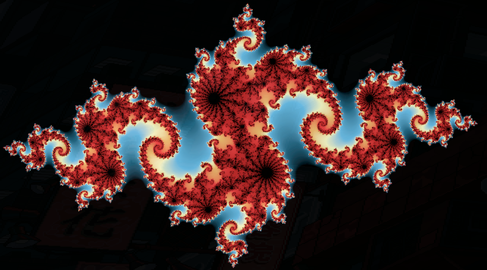

# Rust Fractal Explorer with Bevy

        
Contents

        <ol>
                <li>
                        <a href="#purpose">Purpose</a>
                </li>
                <li>
                        <a href="#about-this-project">About this Project</a>
                        <ul>
                                <li><a href="#goals">Goals</a></li>
                        </ul>
                </li>
                <li><a href="#roadmap">Roadmap</a></li>
                <li><a href="#contributing">Contributing</a></li>
        </ol>

## About this Project

This project's purpose is to create a visually captivating and interactive fractal explorer using Rust and the Bevy engine. It focuses on rendering Julia fractals, offering real-time interactions and visualizations.

The original version was implemented with wasm, but I have since moved to bevy, due to the tools available for expanding features and functionality.

This project is based off the super simple and fun [tutorial](https://www.youtube.com/watch?v=g4vN2Z0JuZI&ab_channel=timClicks) that [Tim McNamara](https://www.linkedin.com/in/timmcnamaranz/) did. 

### Goals

The primary goal of this project is to explore the capabilities of Rust and Bevy in creating high-performance, real-time graphical applications. We aim to:

- Create a dynamic fractal rendering engine using Rust.
- Utilize Bevy for real-time fractal visualization and interactions.
- Provide an educational and engaging experience for users to explore and learn about fractals.

## Roadmap:

### Rendering Engine

- [ ] **Fractal Generation using Rust**
    - [x] Implement Julia fractal generation.
    - [ ] Optimize fractal generation for performance.
    - [ ] Implement 'infinite zoom' functionality.
        - [x] Implement 'Zoom' functionality
        - [ ] Implement return to 1.0x zoom functionality
    - [ ] **Add support for different fractal types:**
        - [ ] Add the Mandelbrot Set
        - [ ] Add the Koch Snowflake
        - [ ] Add the Barnsley fern
        - [ ] Add the Sierpiński triangle
    - [ ] Allow for multiple sets that can be rendered

- [ ] **Integration with Bevy Engine**
    - [x] Setup Bevy to handle real-time rendering.
    - [ ] Create interactive UI elements 
        - [ ] For fractal manipulation.
        - [ ] For selecting fractal parameters
        - [ ] For selecting fractal set
    - [ ] Update to Bevy 0.13.0

- [ ] **Optimization and Enhancement**
    - [x] Add color to rendering
    - [ ] Model render color scheme selection
    - [ ] Implement shader-based rendering for complex visual effects.
    - [ ] Benchmarking Application for Bottlenecks
    - [ ] Refactor Codebase for extensisibility 

### Additional Features

- [ ] **User Interaction**
    - [x] Implement click to navigate.
    - [ ] Click and Drag to move view
    - [ ] Allow users to modify fractal parameters in real-time.
    - [ ] Color pallette selection for fractal set colors

- [ ] **Educational Content**
    - [ ] Provide informational content on fractals and their mathematical significance.

### Documentation & Community

- [ ] **Documentation**
    - [ ] Create thorough documentation for setup and usage.
    - [ ] Document the mathematical concepts behind fractals.
    - [ ] Better commenting for Documentation
    - [ ] Project Documentation

- [ ] **Community Engagement**
    - [ ] Establish a platform for community feedback and contributions.
    - [ ] UI Splash Screen

- [x] **Web Assembly**
    - [x] Setup application to compile to wasm and run in browser

- [ ] **Testing**
    - [ ] Implement Testing
        - [ ] Unit Testing for code integrity
        - [ ] Community testing for feedback and improvements

## Contributing

We welcome contributions from everyone, regardless of your experience level! Here's how you can help:

### For Developers:
- **Code Contributions**: Check out our [Issues](https://github.com/RPG-Alex/project-julia/issues) for tasks needing help. Feel free to comment on an issue if you're interested, or submit a [Pull Request](https://github.com/RPG-Alex/project-julia/pulls) with your changes.
- **Testing**: Help us test the application on different platforms and report any bugs or suggestions for improvements.
    - Please submit an issue if you find a bug, suggestion for enhancement or anything else!

### For Non-Developers:
- **Documentation**: Assist in improving or translating the project documentation to make it more accessible.
- **Educational Content**: Contribute explanations, tutorials, or educational material on fractals and mathematics.

### Getting Started:
1. Fork the repository.
2. Clone your fork and create a new branch for your feature or fix.
3. Commit your changes and push to your fork.
4. Submit a Pull Request against our `Staging` branch.

For more detailed instructions, check out our [CONTRIBUTING.md](https://github.com/RPG-Alex/project-julia/blob/main/CONTRIBUTING.md) guide.

### Community:
Join our discussion platform on [discord](https://discord.gg/AXqf3FU2) to connect with other contributors and discuss ideas, design decisions, and more.

Your contributions, big or small, are greatly appreciated and make our project better for everyone!

[RETURN TO TOP](#readme-top)

[<a href="#readme-top">RETURN TO TOP</a>]

