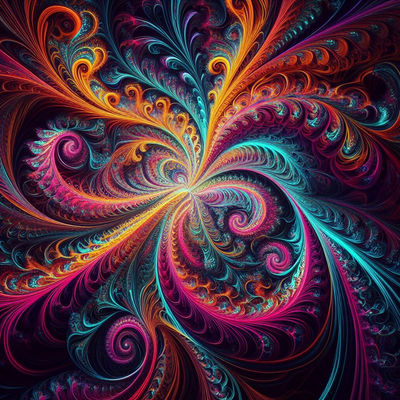

# Rust Fractal Explorer with Bevy

        
Contents

        <ol>
                <li>
                        <a href="#purpose">Purpose</a>
                </li>
                <li>
                        <a href="#about-this-project">About this Project</a>
                        <ul>
                                <li><a href="#goals">Goals</a></li>
                        </ul>
                </li>
                <li><a href="#roadmap">Roadmap</a></li>
                <li><a href="#contributing">Contributing</a></li>
        </ol>

## About this Project

This project's purpose is to create a visually captivating and interactive fractal explorer using Rust and the Bevy engine. It focuses on rendering Julia fractals, offering real-time interactions and visualizations.

The original version was implemented with wasm, but I have since moved to bevy, due to the tools available for expanding features and functionality.

This project is based off the super simple and fun [tutorial](https://www.youtube.com/watch?v=g4vN2Z0JuZI&ab_channel=timClicks) that [Tim McNamara](https://www.linkedin.com/in/timmcnamaranz/) did. 

### Goals

The primary goal of this project is to explore the capabilities of Rust and Bevy in creating high-performance, real-time graphical applications. We aim to:

- Create a dynamic fractal rendering engine using Rust.
- Utilize Bevy for real-time fractal visualization and interactions.
- Provide an educational and engaging experience for users to explore and learn about fractals.

## Roadmap:

### Rendering Engine

- [ ] **Fractal Generation using Rust**
    - [ ] Implement Julia fractal generation.
    - [ ] Optimize fractal generation for performance.
    - [ ] Implement 'Zoom' functionlity
    	    - [ ] Implement 'infinite zoom' functionality.

- [ ] **Integration with Bevy Engine**
    - [ ] Setup Bevy to handle real-time rendering.
    - [ ] Create interactive UI elements for fractal manipulation.

- [ ] **Optimization and Enhancement**
    - [ ] Add support for different fractal types.
    - [ ] Implement shader-based rendering for complex visual effects.

### Additional Features

- [ ] **User Interaction**
    - [ ] Implement zoom and navigation within fractal space.
    - [ ] Allow users to modify fractal parameters in real-time.

- [ ] **Educational Content**
    - [ ] Provide informational content on fractals and their mathematical significance.

### Documentation & Community

- [ ] **Documentation**
    - [ ] Create thorough documentation for setup and usage.
    - [ ] Document the mathematical concepts behind fractals.

- [ ] **Community Engagement**
    - [ ] Establish a platform for community feedback and contributions.

## Contributing

Contributions are welcome, especially from those interested in Rust, graphics programming, and fractal mathematics. Whether you're a beginner or an experienced developer, your input can help make this project a valuable educational tool and an engaging experience.

[<a href="#readme-top">RETURN TO TOP</a>]

